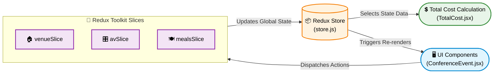
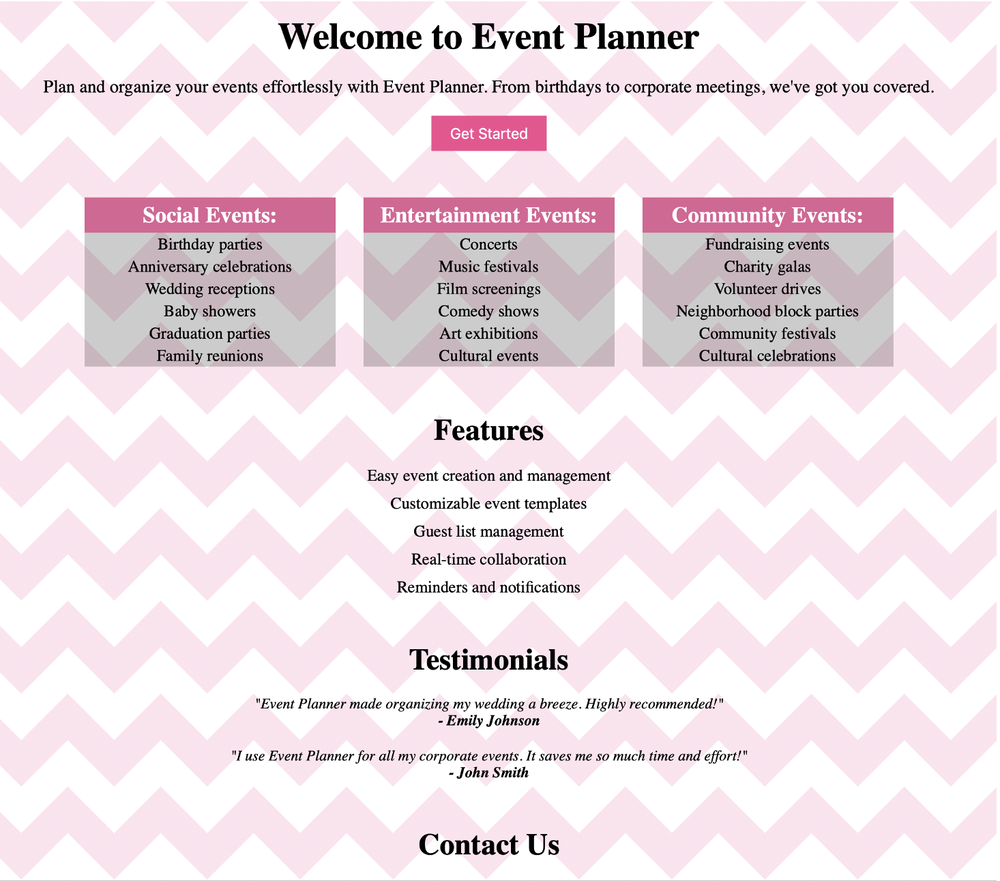
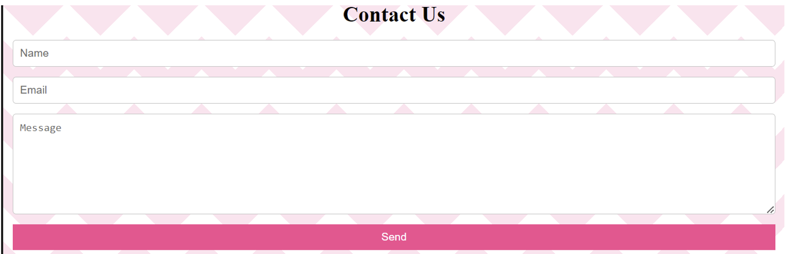

<div align="center">

# 🗓️ Conference Event Planner

Efficiently plan, organize, and manage conferences and events with ease. A comprehensive web application designed to streamline event scheduling, attendee management, and speaker coordination.

[](https://reactjs.org/)
[](https://redux.js.org/)
[](#)
[](#)
[](#)
[](#)
<br>
[](https://www.coursera.org/professional-certificates/ibm-full-stack-cloud-developer)
[](#)

</div>

---

## 📌 Project Overview

**conference_event_planner** is a comprehensive web application designed to streamline the organization of conferences, workshops, and events. It offers powerful, easy-to-use tools for scheduling, attendee management, speaker coordination, and real-time updates to ensure a smooth, professional event experience.

*Make your event planning effortless and successful!*

---

## 🏗️ State Management Architecture


---

## ✨ Key Features

* **📅 Event & Session Scheduling:** Create, manage, and adjust timeblocks for your events effortlessly.
* **📝 Registration & Cost Tracking:** Seamlessly calculate total costs with dedicated pricing modules.
* **🎛️ Venue & AV Management:** Configure venue selections, meals, and audio/visual (AV) equipment requirements.
* **📊 Dynamic State Management:** Real-time updates and accurate calculations powered by Redux Toolkit.
* **📱 Responsive Design:** A flawless, accessible experience optimized for both mobile and desktop screens.

---

## 🛠️ Core Tech Stack

| Category | Technologies Used | Purpose |
| :--- | :--- | :--- |
| **Frontend Framework**| React.js | Building a fast, interactive, and component-based UI (`.jsx` structure) |
| **State Management** | Redux Toolkit | Centralized state architecture utilizing `store.js` and modular slices (`*Slice.js`) |
| **Styling & Layout** | CSS3 | Component-level styling for structured, responsive layouts (`.css`) |
| **Version Control** | Git, GitHub | Codebase management and feature versioning |

---

## 📸 Visual Proof

The following screenshots demonstrate the frontend rendering and UI component structuring built with React.js and standard CSS.

**1. Application Landing Page (`AboutUs.jsx`)**  
*A view of the initial React component serving as the application's entry point. It demonstrates structured CSS layouts, categorized event capabilities (Social, Entertainment, Community), and static informational rendering before complex Redux state interaction begins.*


**2. User Interaction & Form Component**  
*The Contact Us section illustrating standard React form structuring. It features responsive text inputs and a submission handler ready to be connected to backend APIs or state dispatchers for capturing user inquiries.*


---

## 📁 Project Structure

Based on the repository architecture, the application modularizes its features into specific React components and Redux slices:

```text
conference_event_planner/
├── assets/                    # Static images and visual assets
├── store.js                   # Redux Toolkit centralized store configuration
├── avSlice.js                 # Redux slice for Audio/Visual equipment state
├── mealsSlice.js              # Redux slice for catering and meal selections
├── venueSlice.js              # Redux slice for venue and room scheduling
├── App.jsx / App.css          # Root application component and styles
├── main.jsx / index.css       # Application entry point and global styles
├── AboutUs.jsx                # Informational landing component
├── ConferenceEvent.jsx        # Core event management component
├── TotalCost.jsx              # Cost calculation and summary component
└── README.md                  # Project documentation
```

⚙️ Local Setup & Execution
To run this event planner application locally on your machine:

1. Clone the Repository
```text
git clone [https://github.com/HAMED-PAYANDA/conference_event_planner.git](https://github.com/HAMED-PAYANDA/conference_event_planner.git)
cd conference_event_planner
```

2. Install Dependencies
Ensure you have Node.js installed, then install the required packages (including React and Redux):
```text
npm install
```

3. Run the Development Server
Launch the application:
```text
npm start
```

The application will now be accessible in your web browser at http://localhost:3000/ or http://localhost:5173/.

## 👤 Author

**Hamed Payanda**
* **GitHub:** [@HAMED-PAYANDA](https://github.com/HAMED-PAYANDA)
* Completed as part of the **IBM Full-Stack Software Developer Professional**.

